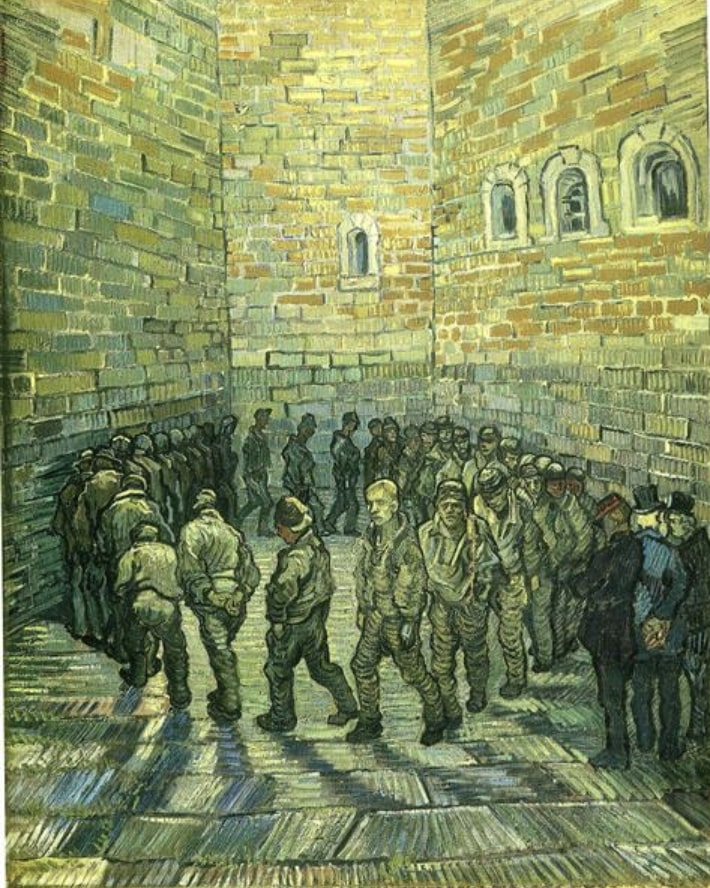
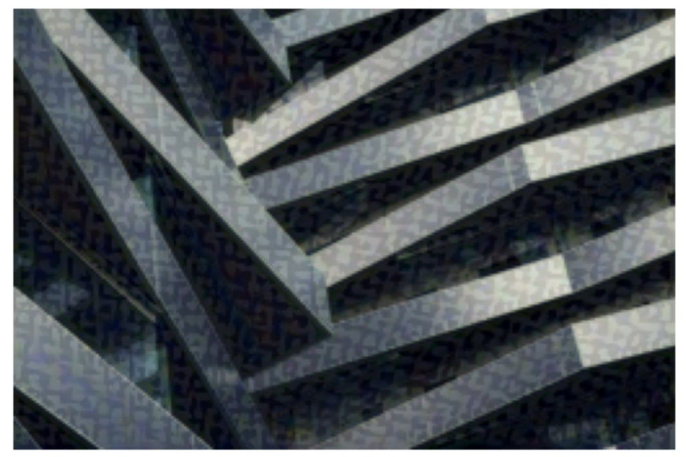

# Task 05 – Neural Style Transfer 🧠🎨

This project implements a **Neural Style Transfer** model using PyTorch. It applies the artistic style of one image (e.g., a painting) to the content of another image (e.g., a photo) using a pre-trained VGG19 network.

---

## 📌 Task Info
- **Internship Track:** Generative AI
- **Track Code:** GA
- **Task Code:** PRODIGY_GA_05
- **Internship Provider:** Prodigy InfoTech

---

## 📂 Project Structure

- `neural_style_transfer.ipynb` – Google Colab notebook with implementation
- `content.jpg` – Content image
- `style.jpg` – Style image
- `output.jpg` – Final stylized image

---

## 🔧 Technologies Used

- Python
- PyTorch
- Google Colab
- VGG19 (Pre-trained model)
- Neural Style Transfer Algorithm

---

## 🧠 What I Learned

- Using **VGG19** for feature extraction
- Computing **content loss** and **style loss**
- Optimizing a target image through backpropagation
- Image pre-processing and tensor manipulation in PyTorch

---

## 📸 Output

| Content Image | Style Image | Output Image |
|---------------|-------------|---------------|
|  |  |  |

---

## 🚀 Run on Colab
[Click here to run the notebook](https://colab.research.google.com/drive/YOUR_NOTEBOOK_LINK)

---

## ✅ Task Completed as part of:
> Prodigy InfoTech – Generative AI Internship | June 2025  
> Tag: #ProdigyInfoTech #GenerativeAI #AIInternship
